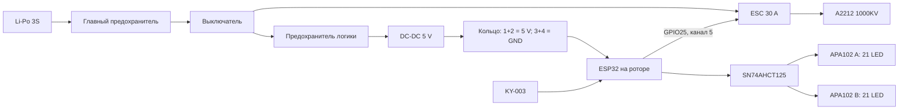

# Архитектура и назначение выводов

## Разделение системы

Неподвижная часть: Li-Po 3S, предохранитель, выключатель, ESC, A2212 и DC-DC 5 В. Вращающаяся часть: ESP32, KY-003, SN74AHCT125 и две лопасти APA102.

## Шестиканальное кольцо

| Канал | Предварительное назначение | Условие |
|---:|---|---|
| 1 | +5V_ROTOR | Параллельно каналу 2 только после проверки каждого канала |
| 2 | +5V_ROTOR | То же |
| 3 | GND_ROTOR | Параллельно каналу 4 после проверки |
| 4 | GND_ROTOR | То же |
| 5 | ESC_PWM | GPIO25 → 220 Ом → роторный конец → статорный ESC |
| 6 | Резерв | Оба конца изолировать |

Параллельные контакты могут делить ток неравномерно. Окончательное разрешение зависит от сопротивления каналов и нагрузочного теста.

## SN74AHCT125N

| Канал микросхемы | Вход | Выход | Назначение |
|---|---:|---:|---|
| 1 | pin 2 | pin 3 | GPIO18 → DATA A |
| 2 | pin 5 | pin 6 | GPIO19 → CLOCK A |
| 3 | pin 9 | pin 8 | GPIO23 → DATA B |
| 4 | pin 12 | pin 11 | GPIO22 → CLOCK B |

Pins 1, 4, 10 и 13 (`OE`) соединить с GND. Pin 14 → 5 В, pin 7 → GND. Конденсатор 100 нФ установить непосредственно между pins 14 и 7. На каждом из четырёх выходов нужен последовательный резистор 330–470 Ом.

## Питание лопастей

Питание обеих лопастей разводится звездой от центральной точки ротора. Нельзя пропускать питание второй лопасти через первую. У входа каждой ленты требуется локальная развязка; номиналы уточняются после измерения пульсаций и длины проводов.

